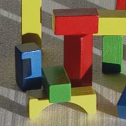
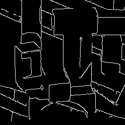
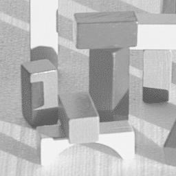
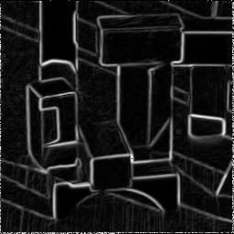

# Maths behind Edge Detection

An attempt to implement edge detection from scratch and to learn the math behind that.

#### Original Color Image

#### Using OpenCV's implementation of Canny Edge Detector

### My Own Implementation

1. Converted the image to GrayScale   
2. Applied a little Gaussian Blur to remove grains   
3. Applied the Sobel Operator   

